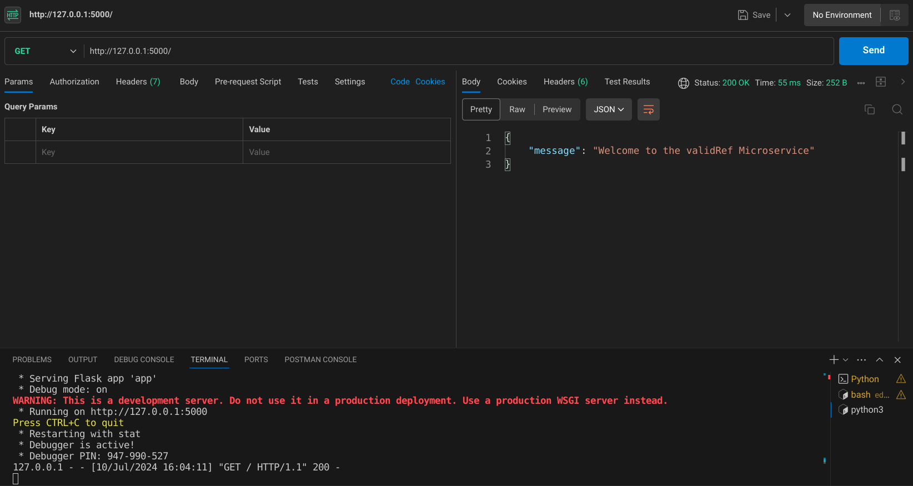
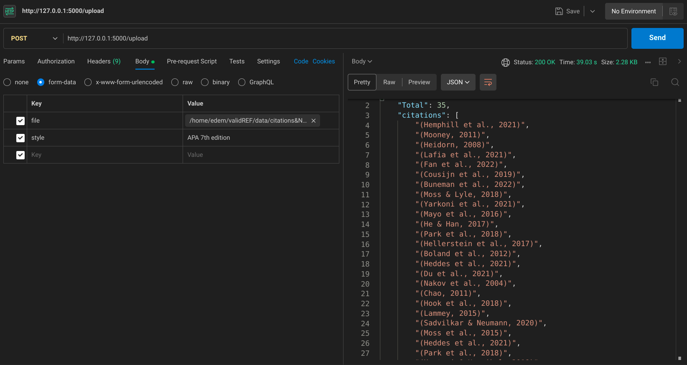

# validREF
A microservice that validates all APA 7th edition citings in a research paper or article

## Screenshots
/


/upload


## Current endpoints

- / (GET route) - about page, provides info on the microservice
- /uploads (POST route) - recieves and processes uploaded documents.
Upload returns a JSON object containing a  extracted, valid and invalid citations as well as a count of each...See postman examples above.

## Intsall dependencies

```bash
pip install requirements.txt
```
## Usage
- Create .env file
- Add your openAI access token
- Run
```bash
python3 app.py
```